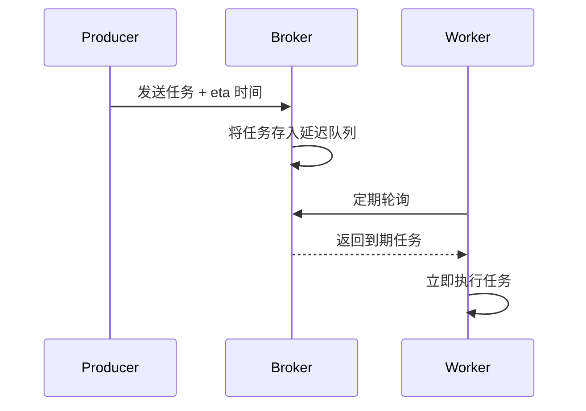
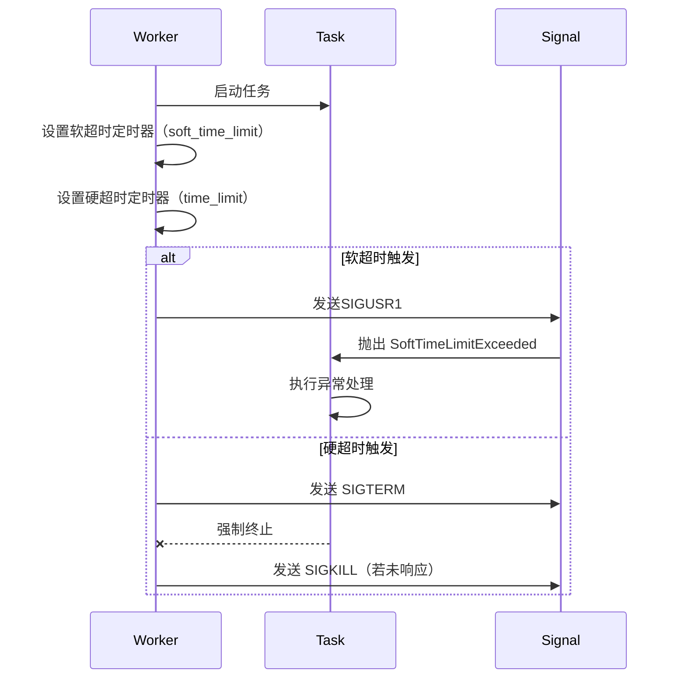

## 背景

Celery 是 Python 项目中常用的定时/异步任务框架，很多时候我们都是 `some_task.delay(arg_a, arg_b)` 往队列一丢就完事，但其实 Celery 还有很多强大的功能，藏在代码与文档中等待被发现。

恰好前前前段时间搞 [bk-user](https://github.com/TencentBlueKing/bk-user) 项目时使用到 Celery 的任务超时控制功能，因此决定写篇源码笔记，简单记录下一些学习收获。

## 代码、分析与示例

### 任务签名

```python
class Task:

    def s(self, *args, **kwargs):
        """Create signature.

        Shortcut for ``.s(*a, **k) -> .signature(a, k)``.
        """

    def si(self, *args, **kwargs):
        """Create immutable signature.

        Shortcut for ``.si(*a, **k) -> .signature(a, k, immutable=True)``.
        """
```

`task.s()` 和 `task.si()` 是用于创建签名（signature）的两种方法，其主要区别在于参数是否可变（i -> immutable）。

签名即是对 Celery 任务调用的封装，方便在任务链、任务组、回调等场景中使用，一个典型的签名对象长这样：

```python
Signature(
    # celery 任务（task）名称
    "bkuser.apps.sync.tasks.sync_data_source",
    # 任务参数
    args=(),
    # 任务关键字参数
    kwargs={"task_id": 127, "extras": {"foo": "bar"}},
    # 执行相关（队列，重试等）配置，如：{'queue': 'high_priority'}
    options={}
)
```

上面这个签名可以通过这样的方式来生成：`sync_data_source.s(task_id=127, extras={"foo": "bar"})`

任务签名最常用的使用方式即为：链式任务流水线（虽然有时候单个 task 中就包含整个流程，但有时为了任务复用也可能会进行拆分）

```python
# 数据源同步工作流（带异常回滚）
chain = (
    sync_data_source.si(127,)                # 数据源同步
    | send_notify.si(email="schnee@qq.com")  # 发送邮件通知
    | record_results.s()                     # 记录同步结果
).on_error(rollback.si(job_id=127))          # 出错时回滚

# 异步执行工作流
chain.delay()
```

如果看过 [pipe-in-python](https://narasux.cn/articles/pipe-in-python) 这篇文章，应该可以明显看出 `Signature`
这个类[重载](https://github.com/celery/celery/blob/c556c30794bfbe0831bbad007a00e00a0ddfc960/celery/canvas.py#L758)了魔术方法
`__or__`，使其能够通过 `|` 运算符将多个任务签名组装成 chain

### hooks

```python
class Task:

    def before_start(self, task_id, args, kwargs):
        """Handler called before the task starts.

        Arguments:
            task_id (str): Unique id of the task to execute.
            args (Tuple): Original arguments for the task to execute.
            kwargs (Dict): Original keyword arguments for the task to execute.

        Returns:
            None: The return value of this handler is ignored.
        """

    def on_success(self, retval, task_id, args, kwargs):
        """Success handler.

        Run by the worker if the task executes successfully.

        Arguments:
            retval (Any): The return value of the task.
            ...

        Returns:
            None: The return value of this handler is ignored.
        """

    def on_retry(self, exc, task_id, args, kwargs, einfo):
        """Retry handler.

        This is run by the worker when the task is to be retried.

        Arguments:
            exc (Exception): The exception sent to :meth:`retry`.
            ...
            einfo (~billiard.einfo.ExceptionInfo): Exception information.
        """

    def on_failure(self, exc, task_id, args, kwargs, einfo):
        """Error handler.

        This is run by the worker when the task fails.
        """

    def after_return(self, status, retval, task_id, args, kwargs, einfo):
        """Handler called after the task returns.

        Arguments:
            status (str): Current task state.
            ...
        """

    def on_replace(self, sig):
        """Handler called when the task is replaced.

        Must return super().on_replace(sig) when overriding to ensure the task replacement
        is properly handled.

        Arguments:
            sig (Signature): signature to replace with.
        """

```

在任务执行的不同生命周期阶段，可以配置相应的 Hook 以执行回调命令，目前提供的 Hook 有任务启动前、成功时、重试时、失败时、任务结果返回后、任务被替换时。

生命周期 hook 的一些使用场景：

```python
# 灰度发布 -> on_replace 做任务转发
class PaymentTask(ReplaceAwareTask):

    def on_replace(self, new_task, args, kwargs):
        new_task.delay(*args, **kwargs)
        logger.info(f"Redirected payment to {new_task.name}")

# 动态替换
if is_new_feature_enabled(user_id):
    old_task.replace(NewPaymentTask)
```

```python
# 故障降级 -> on_retry 控制重试一定次数后服务降级，on_replace 记录降级事件
class RecommendationTask(ReplaceAwareTask):
    def on_retry(self, exc, task_id, args, kwargs, einfo):
        if retries > 3:
            self.replace(FallbackRecTask, kwargs={**kwargs, 'mode': 'basic'})

    def on_replace(self, new_task, args, kwargs):
        metrics.counter("degradation.count", tags={"task": self.name})
```

### 任务分发 - 同步

```python
class Task:

    def apply(self, args=None, kwargs=None,
              link=None, link_error=None,
              task_id=None, retries=None, throw=None,
              logfile=None, loglevel=None, headers=None, **options):
        """Execute this task locally, by blocking until the task returns.

        Arguments:
            args (Tuple): positional arguments passed on to the task.
            kwargs (Dict): keyword arguments passed on to the task.
            throw (bool): Re-raise task exceptions.
                Defaults to the :setting:`task_eager_propagates` setting.

        Returns:
            celery.result.EagerResult: pre-evaluated result.
        """
```

如果是使用 `task.apply()` 任务就只会在本地执行，而不会投递到消息队列并由 worker
来消费（效果和直接函数调用差不多），一般只会用于开发调试 / 单元测试中，在某些情况下也会用于小数据 / 短耗时任务的执行。

### 任务分发 - 异步

```python
class Task(object):

    def delay(self, *args, **kwargs):
        """Star argument version of :meth:`apply_async`.

        Does not support the extra options enabled by :meth:`apply_async`.

        Arguments:
            *args (Any): Positional arguments passed on to the task.
            **kwargs (Any): Keyword arguments passed on to the task.
        Returns:
            celery.result.AsyncResult: Future promise.
        """
        return self.apply_async(args, kwargs)

    def apply_async(self, args=None, kwargs=None, task_id=None, producer=None,
                    link=None, link_error=None, shadow=None, **options):
        """Apply tasks asynchronously by sending a message.

        Arguments:
            ...

        Returns:
            celery.result.AsyncResult: Promise of future evaluation.

        Raises:
            TypeError: If not enough arguments are passed, or too many
                arguments are passed.  Note that signature checks may
                be disabled by specifying ``@task(typing=False)``.
            kombu.exceptions.OperationalError: If a connection to the
               transport cannot be made, or if the connection is lost.

        Note:
            Also supports all keyword arguments supported by
            :meth:`kombu.Producer.publish`.
        """
```

从函数实现可以看出，`delay` 其实是 `apply_async` 函数的简化封装，只支持最重要的 `args & kwargs` 参数。

#### 参数说明 & 实现分析

##### 任务参数 / headers

```text
args (Tuple): The positional arguments to pass on to the task.

-> 位置参数（无名）
```

```text
kwargs (Dict): The keyword arguments to pass on to the task.

-> 关键字参数（具名），优先级高于 args
```

```text
headers (Dict): Message headers to be included in the message.

-> 头部信息，一般是与任务无直接关系的，如调用用户信息，traceID，路由 / 调度配置等
```

使用示例：

```python
# bind = True 绑定任务实例，从而可以访问 self 对象
@app.task(bind=True)
def add(self, x, y):
    print(f"Headers: {self.request.headers}")
    return x + y

headers = {'user': 'admin'}

result = add.apply_sync(args=(2, 3), headers=headers)

result = add.apply_sync(kwargs={"x": 2, "y": 3}, headers=headers)
```

注意：headers 仅适合传递轻量的数据，如果向 headers 塞入过大的数据，可能在使用 RabbitMQ 作为 backend 时候会导致任务失败！

更多信息请查看：[布鲁斯鱼 - 不要往 AMQP 的 Header 乱塞东西](https://emergencyexit.xyz/amqp-header-has-frame-max-limit.html)

##### 延迟执行

```text
countdown (float): Number of seconds into the future that the
    task should execute.  Defaults to immediate execution.

=> 指定延迟时间（timedelta，单位 s），默认立即执行
```

```text
eta (~datetime.datetime): Absolute time and date of when the task
    should be executed.  May not be specified if `countdown`
    is also supplied.

=> 指定延迟时间（精确的 datetime），优先级低于 countdown
```

使用示例：

```python
# 十秒钟后执行
add.apply_async(args=(2, 3), eta=now + timedelta(seconds=10))

# 60 秒后执行
add.apply_async(args=(2, 3), countdown=60)
```

实现细节：

1. Celery 最终使用的还是 `eta`，即任务预期执行时间（使用 `countdown` 参数最后也是转换成 `eta`）
2. Celery 会定期检查消息队列是否支持延迟消息（如 RabbitMQ 的延迟插件或 Redis 的延迟队列），若支持则会立刻推送到消息队列，由消息队列控制任务执行。
3. 如果不支持延迟消息，则由 worker 进行控制，如果任务的 `eta` 时间还没到达，则会将任务放入一个内部的延迟队列，再次检查直到到达
   `eta` 时间才执行。



相关 Celery
配置：[broker_heartbeat_checkrate](https://docs.celeryq.dev/en/stable/userguide/configuration.html#broker-heartbeat-checkrate)
，可用于调整轮询延迟任务的时间间隔。

##### 任务过期 & 超时

```text
expires (float, ~datetime.datetime): Datetime or
    seconds in the future for the task should expire.
    The task won't be executed after the expiration time.

time_limit (int): If set, overrides the default time limit.

soft_time_limit (int): If set, overrides the default soft time limit.
```

使用示例：

`expires` 支持相对时间（单位：s）或指定时间（datetime），worker 在执行之前会检查 `expires`，如果已经过期则会丢弃而非继续执行

```python
# 使用相对时间（timedelta）的情况
add.apply_async((10, 10), expires=60)

# 使用 datetime 的情况
from datetime import datetime, timedelta, timezone
add.apply_async((10, 10), expires=datetime.now(timezone.utc) + timedelta(days=1))
```

`time_limit` & `soft_time_limit` 可用于控制任务的执行时间（超时）。

他们的区别是：`time_limit` 会强制杀死进程，而 `soft_time_limit` 会在任务执行超时的时候，抛出 `SoftTimeLimitExceeded`
异常，开发者可以捕获并进行相应的处理。

```python
from celery.exceptions import SoftTimeLimitExceeded

@app.task
def long_running_task():
    try:
        return do_work()
    except SoftTimeLimitExceeded:
        cleanup_in_a_hurry()

# 在下发任务的时候，指定超时时间（注意必须满足 time_limit >= soft_time_limit）
long_running_task.apply_async(time_limit=120, soft_time_limit=60)
```

实现细节：

**soft_time_limit:**

1. 在任务开始执行时，Celery 设置一个定时器，定时时间为 `soft_time_limit`
2. 当定时器触发时，向任务进程发送 `SIGUSR1` 信号
3. 任务捕获 `SIGUSR1` 信号并抛出 `SoftTimeLimitExceeded` 异常

**time_limit:**

1. 在任务开始执行时，Celery 设置一个定时器，定时时间为 `time_limit`
2. 当定时器触发时，向任务进程发送 `SIGTERM + SIGKILL` 信号，任务进程被强制终止



相关实现：

- `billiard.pool.TimeoutHandler.on_soft_timeout`
- `billiard.pool.TimeoutHandler.on_hard_timeout`

##### 重试策略

```text
retry (bool): If enabled sending of the task message will be
    retried in the event of connection loss or failure.
    Default is taken from the :setting:`task_publish_retry`
    setting.  Note that you need to handle the
    producer/connection manually for this to work.

=> 判断是否启用发送重试机制

retry_policy (Mapping): Override the retry policy used.
    See the :setting:`task_publish_retry_policy` setting.

=> 重试机制相关配置
```

使用示例：

```python
# 发送任务时配置重试策略
result = fetch_data.apply_async(
    args=['https://api.example.com/data'],
    # 启用发送重试
    retry=True,
    retry_policy={
        # 最多重试 5 次
        'max_retries': 5,
        # 首次等待 0.5 秒
        'interval_start': 0.5,
        # 每次增加 1 秒等待
        'interval_step': 1.0,
        # 最长等待 5 秒
        'interval_max': 5.0,
    }
)
```

当消息发送到 Broker（如 RabbitMQ / Redis）失败时，Celery 将会根据配置自动重试投递。

##### 任务调度

```text
shadow (str): Override task name used in logs/monitoring.
    Default is retrieved from :meth:`shadow_name`.

=> 覆盖 Worker 日志和监控工具（如 Flower）中显示的任务名称
```

```text
connection (kombu.Connection): Re-use existing broker connection
    instead of acquiring one from the connection pool.

=> 复用已有的 Kombu 连接对象，避免从连接池重复创建，提升高并发下的发布效率
```

使用示例：

```python
from kombu import Connection

# 创建持久化连接
conn = Connection("redis://localhost:6379")
producer = conn.Producer()

# 复用连接发布任务
task.apply_async(args=(data,), connection=conn)
```

```text
queue (str, kombu.Queue): The queue to route the task to.
    This must be a key present in :setting:`task_queues`, or
    :setting:`task_create_missing_queues` must be
    enabled.  See :ref:`guide-routing` for more
    information.

exchange (str, kombu.Exchange): Named custom exchange to send the
    task to.  Usually not used in combination with the ``queue``
    argument.

routing_key (str): Custom routing key used to route the task to a
    worker server.  If in combination with a ``queue`` argument
    only used to specify custom routing keys to topic exchanges.
```

| 参数          | 作用                                      | 关联配置                                   |
|-------------|-----------------------------------------|----------------------------------------|
| queue       | 指定任务投递的目标队列（需预先在 task_queues 中声明）       | task_create_missing_queues=False（严格模式） |
| exchange    | 自定义交换机（仅高级 RabbitMQ 路由需求使用，如广播任务）       | 需同步设置 routing_key                      |
| routing_key | 配合交换机使用的路由键（如 "payment.high" 路由到高优先级队列） | task_routes 全局配置                       |

使用示例：

```python
# 定义专用队列
app.conf.task_queues = {
    "high_priority": Queue("high", exchange=Exchange("priority"), routing_key="payment.high"),
    "low_priority": Queue("low", exchange=Exchange("default"), routing_key="report.low")
}

# 路由任务到高优先级队列
process_payment.apply_async(queue="high_priority", routing_key="payment.high")
```

```text
priority (int): The task priority, a number between 0 and 9.
    Defaults to the :attr:`priority` attribute.

=> 任务优先级调度：指定任务在队列中的优先级（0-9），数值越高优先级越高（RabbitMQ 中 0 为最高）
```

##### IO

```text
serializer (str): Serialization method to use.
    Can be `pickle`, `json`, `yaml`, `msgpack` or any custom
    serialization method that's been registered
    with :mod:`kombu.serialization.registry`.
    Defaults to the :attr:`serializer` attribute.

=> 序列化方式，可选 pickle / json / yaml / msgpack 等，默认为 json。

compression (str): Optional compression method
    to use.  Can be one of ``zlib``, ``bzip2``,
    or any custom compression methods registered with
    :func:`kombu.compression.register`.
    Defaults to the :setting:`task_compression` setting.

=> 消息压缩方式，可选 zlib / bzip2，用于对消息进行压缩，降低队列资源压力。
```

##### 触发器

```text
link (Signature): A single, or a list of tasks signatures
    to apply if the task returns successfully.

=> 当任务成功执行后，自动触发指定的后续任务。

link_error (Signature): A single, or a list of task signatures
    to apply if an error occurs while executing the task.

=> 当任务执行失败时（如异常、超时），自动触发错误处理任务（如告警、回滚）。
```

##### 其他

```text
producer (kombu.Producer): custom producer to use when publishing the task.

=> 定制任务发布逻辑
 - 需要复用特定 Broker 连接（如共享连接池）
 - 实现自定义序列化或消息压缩策略
 - 监控任务发布过程（如记录发布耗时）

add_to_parent (bool): If set to True (default) and the task
    is applied while executing another task, then the result
    will be appended to the parent tasks ``request.children``
    attribute.  Trailing can also be disabled by default using the
    :attr:`trail` attribute

=> 管理任务树关系
 - 当 add_to_parent=True 时，子任务结果自动挂载到父任务的 request.children 列表
 - 可通过 parent_task.request.children 追踪所有子任务状态
```

## 小插曲

翻阅 Celery 源码时候，发现最近有另外一位开发者添加了一个检查，限制 `soft_time_limit` 不能大于 `time_limit`
，不过异常信息却写错了，觉得会误导其他开发者，因此顺手水个 PR [#9246](https://github.com/celery/celery/pull/9246/files)

```python
def apply_async(...):
    if self.soft_time_limit and self.time_limit and self.soft_time_limit > self.time_limit:
        # 这里的错误信息应该是 less than 而不是 greater than
        raise ValueError('soft_time_limit must be greater than or equal to time_limit')
    ...
```

不得不说 celery pull request 处理真的很活跃，两小时就有回复，当天就合并，比之前 k8s python client 的一个月体验好太多 :D

## 参考资料

- [源码 celery.app.task.Task](https://github.com/celery/celery/blob/c822a5a55f9f97f1949b63dd124e8032106bc779/celery/app/task.py#L164)
- [文档 Celery - Calling Tasks](https://docs.celeryq.dev/en/stable/userguide/calling.html)
