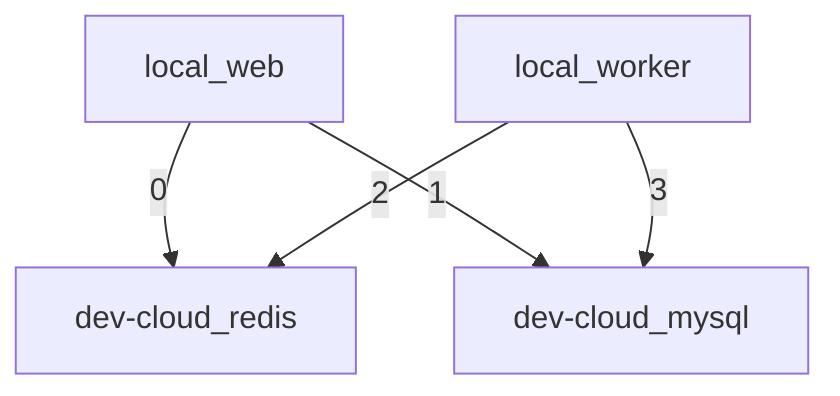
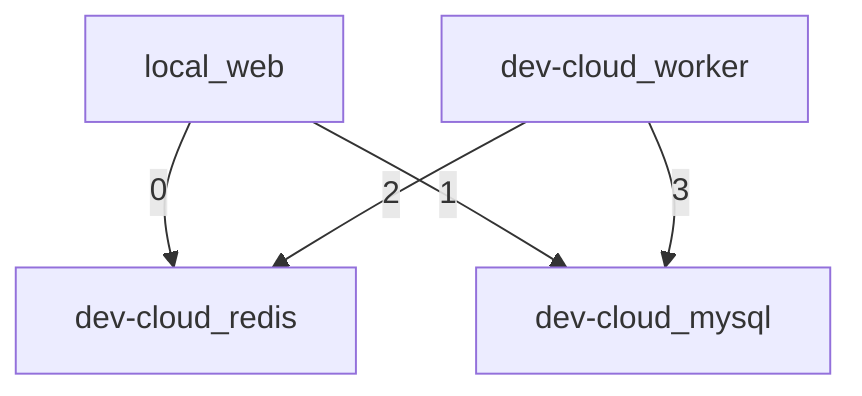
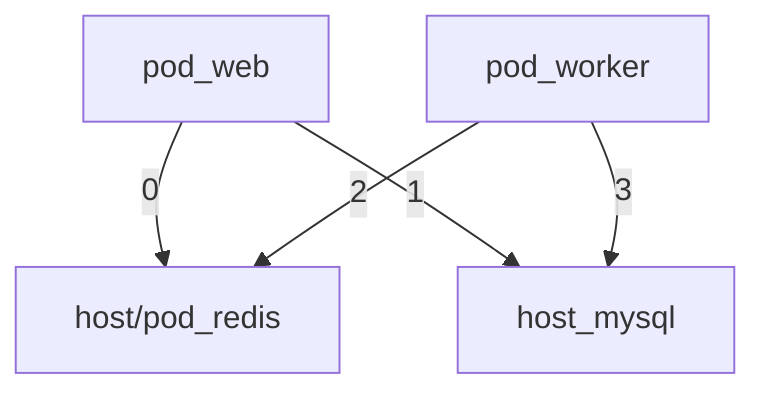

## 背景

开发用户管理过程中，遇到这么一个场景：在数据源同步结束后，生成租户数据同步任务，并由 celery 执行，主要注意的是，两个同步步骤都是大事务。

## 遇到的奇怪问题

本地数据源同步，结束后触发租户同步，两个同步任务执行都是 ok 的，数据，状态流转都是正常的。

发布到联调环境，发现只有部分任务会被执行，大约 70 % 以上的任务，宛如进了黑洞，日志都没有打印出来。

## 排查思路

### 队列共享导致误消费？

切换 redis db -> 切换 redis 实例 (无效)

### 5.x celery 在 linux 下与 redis 存在兼容问题？

redis 切换成 rabbitmq (无效)

### celery 配置问题？

check 一波，修复一些不合适的配置，但是问题依旧存在

### 平台环境问题？

celery 5.x in linux ?

- 本地 shell web + worker 无法复现
- 本地 shell web + docker worker 无法复现
- dev-cloud docker web + worker 偶尔复现
- 本地 shell web + dev-cloud docker worker 高频率复现

难道真是 linux 有问题？为什么本地 arm docker 也是 linux 没问题？

### 降低 celery 版本试试？

celery 5.x 配置及依赖包差别过大，改动测试成本过高，放弃。。。

## 代码实现

既然能够通过本地 shell web + dev-cloud docker worker 复现，那就看看代码是怎么写的

```python
# runners.py (celery)
class DataSourceSyncTaskRunner:
    def run(self):
        with transaction.atomic():
            self._sync_departments()
            self._sync_users()
            self._send_signal()

# handlers.py
@receiver(post_sync_data_source)
def sync_tenant_departments_users(sender, data_source: DataSource, **kwargs):
    TenantSyncManager(data_source, data_source.owner_tenant_id, TenantSyncOptions()).execute()

# managers.py
class TenantSyncManager:
    def execute(self):
        task = TenantSyncTask.objects.create(...)
        sync_tenant.delay(task.id)

# tasks.py (celery)
@app.task(ignore_result=True)
def sync_tenant(task_id: int):
    task = TenantSyncTask.objects.get(id=task_id)
    TenantSyncTaskRunner(task).run()

# runners.py
class TenantSyncTaskRunner:
    def run(self):
        logger.info("xxx xxx xxx")
        with transaction.atomic():
            self._sync_departments()
            self._sync_users()
```

总路径：`runner -> handler -> manager -> task -> runner`

## 检查队列

1. 队列中任务没有堆积，说明任务确实被取走了，但是没有被正常消费
2. 停止 worker，往队列塞任务，启动 worker，所有任务正常消费
3. 说明存在因为时序的原因，导致任务没有正常消费

## 为什么 celery 任务执行没有任何记录？

查询 celery 相关配置说明可知：

1. celery 默认任务即使失败，也不会有错误堆栈输出到日志，需要配置 [on_failure hook](https://docs.celeryq.dev/en/stable/userguide/tasks.html#on_failure) 才有输出

```python
class BaseTask(Task):

    def on_failure(self, exc, task_id, args, kwargs, einfo):
        logger.exception("task %s(%s) failed! args: %s kwargs: %s", self.name, task_id, args, kwargs, exc_info=einfo)
        super().on_failure(exc, task_id, args, kwargs, einfo)

@app.task(base=BaseTask, ignore_result=True)
def sync_tenant(task_id: int):
    ...
```

2. `ignore_result=True` 导致任务执行记录不会存储到指定 backend（DB）中，因此 `django_celery_results_taskresult` 表中没有任何记录。

## 问题查因

在添加 on_failure hook 后迅速发现了问题：`TenantSyncTask.DoesNotExist: TenantSyncTask matching query does not exist.`

但是显然，task 是先创建的，然后才能把 task_id 给到 celery task，之后再去 get，为什么会 not found 呢？

# 是事务！我加了事务！

在事务范围内，`TenantSyncTask.objects.create` 后 `get` 是可以正常完成的，但是 celery 任务是在事务外执行的（不是同进程了都）

因此必须等到**事务**提交后，才能从 DB 中查询到 `TenantSyncTask`。

在本地开发的过程中，我连接的是 devcloud 的 mysql + redis，就会出现 DB 事务提交速度比 worker 从队列获取到任务的速度快

因此任务基本上都是正常执行（其实压几千个还是有失败的）

而到了线上环境，由于可能的网络延迟等原因，celery worker 通过轮询拿到 task 并向数据库发起 get 请求是要比事务提交还要快的，

因此就会导致 `matching query does not exist` 的出现。

#### 本地开发环境



#### 本地 + dev-cloud 复现场景



#### 联调环境



## 解决方案

```python
# runners.py (celery)
class DataSourceSyncTaskRunner:
    def run(self):
        with transaction.atomic():
            self._sync_departments()
            self._sync_users()
        
        # 信号发送（触发后台任务）挪出事务范围
        self._send_signal()
```

如果没有明确的 transaction.atomic() 调用，比如 `post_save()` 信号，如何处理？

```python
@receiver(post_save, sender=DataSource)
def sync_identity_infos_and_notify(sender, instance: DataSource, **kwargs):
    transaction.on_commit(lambda: initialize_identity_info_and_send_notification.delay(instance.id))
```

`transaction.on_commit` 方法可以保证在当前事务提交之后，才会执行包装的代码逻辑，因此建议可能在事务中调用后台任务的，都需要考虑这种场景。

## 还有一个问题

为什么之前在 task 里面 logger.info / logger.exception 都没有打印出来

因为 logger.info 不是加载任务入口，而是在 SyncTaskRunner 中，根本就没有执行到那边去。。。
