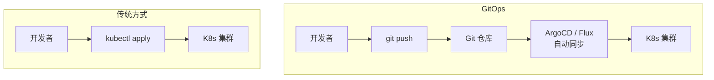

当我们开始管理 Kubernetes 应用时，最先面对的就是一堆 YAML 文件。

一个简单的 Web 应用可能需要 Deployment、Service、ConfigMap、Secret、Ingress 等多个资源，而这些资源在不同的环境（dev / staging / prod）中往往只有少量差异——镜像版本不同、副本数不同、域名不同。

如果直接维护多套 YAML，很快就会陷入复制粘贴的泥潭；如果用脚本拼接，又缺乏结构化的管理方式。这正是 K8s 包管理工具要解决的核心问题：**如何以可复用、可参数化、可版本化的方式管理 K8s 资源配置**。

具体来说，需要面对以下挑战：

- **配置复用**：多环境大部分配置相同，手动维护容易遗漏同步，导致环境漂移
- **参数化与差异化**：简单替换（镜像版本、副本数）容易，但结构化差异（增删字段、条件生成资源）需要更强的表达能力
- **版本与依赖管理**：应用配置的升级、回滚；组件间的部署顺序依赖；配置包的分发与共享
- **正确性保障**：配置值是否合法（如 replicas 不能为负数）、是否满足组织策略（如必须设置 resource limits）

不同工具对这些挑战的解法各不相同，背后是三种不同的设计哲学。

## 模板派 vs 覆盖派 vs 编程派

在讨论之前，需要先区分三种容易混淆的设计哲学：**模板派**、**覆盖派** 和 **编程派**。

### 模板派

模板派通过模板引擎 + 变量替换生成 YAML，代表工具是 `Helm`。

```yaml
# Helm 模板
apiVersion: apps/v1
kind: Deployment
metadata:
  name: {{ include "my-chart.fullname" . }}
spec:
  replicas: {{ .Values.replicaCount }}
```

使用 Helm 时：

- 通过 `Go Template` 语法在 YAML 中嵌入变量和逻辑
- `values.yaml` 文件定义可覆盖的参数
- 渲染时将变量替换为实际值，生成最终 YAML
- 流程：`values.yaml + Go Template → 渲染 → 最终 YAML`

模板派的优点：

- 概念直观：变量替换是最容易理解的参数化方式
- 生态最大：Helm 是 K8s 事实标准的包管理器
- 功能完整：版本管理、依赖管理、仓库分发一应俱全

### 覆盖派

覆盖派在基础 YAML 上做差异覆盖，不引入模板语法，代表工具是 `Kustomize`。

```yaml
# 基础配置
apiVersion: apps/v1
kind: Deployment
metadata:
  name: myapp
spec:
  replicas: 1
```

```yaml
# 环境覆盖（仅修改差异部分）
apiVersion: apps/v1
kind: Deployment
metadata:
  name: myapp
spec:
  replicas: 10
```

使用 Kustomize 时：

- 输入和输出都是标准 YAML，不需要学习模板语法
- 通过 `Strategic Merge Patch` 或 `JSON Patch` 做差异覆盖
- 流程：`base YAML + overlay patches → 合并 → 最终 YAML`

覆盖派的优点：

- 无模板：不引入新语法，学习成本低
- 声明式：覆盖关系清晰，GitOps 友好
- 原生集成：`kubectl` 内置 `kustomize` 子命令

### 编程派

编程派用编程语言或数据语言生成配置，拥有完整的逻辑表达能力，代表工具是 `Jsonnet`、`CUE`、`Pulumi`。

```js
// Pulumi（TypeScript）
const replicas = env === "prod" ? 10 : 1;

const deployment = new k8s.apps.v1.Deployment("myapp", {
    spec: { replicas: replicas, ... }
});
```

使用 Pulumi 时：

- 用真正的编程语言定义 K8s 资源
- 拥有完整的控制流、函数、类型系统
- 流程：`编程语言代码 → 执行 → K8s API 调用`

编程派的优点：

- 逻辑完整：条件判断、循环、函数等不在话下
- 可测试：可以写真正的单元测试
- IDE 友好：自动补全、类型检查、重构

### 关键对比

|        | 模板派         | 覆盖派         | 编程派                    |
|--------|-------------|-------------|------------------------|
| 代表工具   | Helm        | Kustomize   | Jsonnet / CUE / Pulumi |
| 输出审计   | 需要渲染后查看     | 直观（差异即覆盖）   | 需要渲染后查看                |
| 语法学习   | Go Template | 无（纯 YAML）   | 各自的编程语言                |
| 逻辑表达   | 有限（模板函数）    | 无           | 完整                     |
| 核心思路   | 变量替换生成 YAML | 差异覆盖合并 YAML | 编程逻辑生成配置               |

## 常见解决方案

### Helm

Helm 是 Kubernetes 生态中最成熟的包管理工具，被誉为 "Kubernetes 的 apt/yum"。

Chart 结构：

```bash
my-chart/
├── Chart.yaml          # Chart 元信息（名称、版本、依赖等）
├── values.yaml         # 默认配置值
├── templates/
│   ├── deployment.yaml  # Deployment 模板
│   ├── service.yaml     # Service 模板
│   ├── ingress.yaml     # Ingress 模板
│   ├── _helpers.tpl     # 公共模板片段
│   └── notes.txt        # 安装后的提示信息
└── .helmignore
```

`values.yaml`：

```yaml
replicaCount: 3
image:
  repository: myapp
  tag: "1.0.0"
service:
  type: ClusterIP
  port: 80
```

`templates/deployment.yaml`：

```yaml
apiVersion: apps/v1
kind: Deployment
metadata:
  name: {{ include "my-chart.fullname" . }}
spec:
  replicas: {{ .Values.replicaCount }}
  selector:
    matchLabels:
      app: {{ include "my-chart.name" . }}
  template:
    spec:
      containers:
        - name: {{ .Chart.Name }}
          image: "{{ .Values.image.repository }}:{{ .Values.image.tag }}"
          ports:
            - containerPort: {{ .Values.service.port }}
```

部署到不同环境：

```bash
# 开发环境
helm install myapp ./my-chart -f values-dev.yaml

# 生产环境
helm install myapp ./my-chart -f values-prod.yaml
```

`values-prod.yaml`：

```yaml
replicaCount: 10
image:
  tag: "1.0.0-stable"
service:
  type: LoadBalancer
```

需要注意的是，Helm 管理单个 Chart 很方便，但实际项目往往需要同时部署多个 Chart（如 nginx-ingress + cert-manager +
prometheus + myapp），部署顺序和环境差异管理就成了问题。这时候可以用 **Helmfile**——它是 Helm 的声明式编排层，类似
`docker-compose` 和 `docker` 的关系：

```yaml
# helmfile.yaml
repositories:
  - name: jetstack
    url: https://charts.jetstack.io

releases:
  - name: cert-manager
    chart: jetstack/cert-manager
    version: 1.15.3
    namespace: cert-manager

  - name: myapp
    chart: ./charts/myapp
    values:
      - ./values/myapp-{{ .Environment.Name }}.yaml
    needs:
      - cert-manager/cert-manager      # 依赖 cert-manager 先装
```

```bash
# 预览变更（只看不应用）
helmfile diff

# 一条命令同步所有 Release（自动处理部署顺序）
helmfile sync

# 指定环境
helmfile -e prod sync
```

Helmfile 不是 Helm 的替代品，而是补充——它负责编排多个 Release，Helm 负责单个 Chart 的渲染和部署。

Helm 的优点：

- 生态最大：Artifact Hub 上有上万个公开 Chart
- 版本管理：支持 Chart 版本化和 Release 回滚
- 依赖管理：Chart 支持声明依赖其他 Chart
- 开箱即用：`helm install` 一条命令完成部署
- 加密值支持：通过 `helm-secrets` 插件管理敏感配置
- 多 Release 编排：Helmfile 可声明式管理多个 Release 的部署顺序和环境差异

Helm 的缺点：

- Go Template 语法繁琐：管道操作、空格控制令人困惑
- 渲染结果难以预测：模板逻辑复杂时，调试困难
- 覆盖能力有限：深层嵌套的 values 难以精确覆盖部分字段
- 降级风险：`helm rollback` 只回滚 Helm 的 Release 记录，不保证集群状态完全一致
- 多 Release 协调弱：Helm 原生不支持跨 Release 的依赖和顺序，需借助 Helmfile

**适用场景：** 快速部署第三方应用（数据库、监控组件等）；团队希望有现成的生态可用；多 Release 编排场景可配合 Helmfile。

**实际应用：** Bitnami 维护了大量公开的 Helm Chart（覆盖 MySQL、Redis、Nginx 等常用中间件）；ArgoCD 和 Flux 原生支持 Helm 作为应用来源。

### Kustomize

Kustomize 选择了一条不同的路：**不用模板，通过声明式的覆盖来定制配置**。

目录结构：

```bash
app/
├── base/
│   ├── kustomization.yaml
│   ├── deployment.yaml
│   └── service.yaml
└── overlays/
    ├── dev/
    │   ├── kustomization.yaml
    │   └── patch-replicas.yaml
    ├── staging/
    │   ├── kustomization.yaml
    │   └── patch-replicas.yaml
    └── prod/
        ├── kustomization.yaml
        ├── patch-replicas.yaml
        └── patch-resources.yaml
```

`base/deployment.yaml`：

```yaml
apiVersion: apps/v1
kind: Deployment
metadata:
  name: myapp
spec:
  replicas: 1
  selector:
    matchLabels:
      app: myapp
  template:
    spec:
      containers:
        - name: myapp
          image: myapp:latest
          resources:
            requests:
              cpu: 100m
              memory: 128Mi
```

`overlays/prod/patch-replicas.yaml`：

```yaml
apiVersion: apps/v1
kind: Deployment
metadata:
  name: myapp
spec:
  replicas: 10
```

`overlays/prod/kustomization.yaml`：

```yaml
apiVersion: kustomize.config.k8s.io/v1beta1
kind: Kustomization
bases:
  - ../../base
patchesStrategicMerge:
  - patch-replicas.yaml
  - patch-resources.yaml
```

Kustomize 还提供了一些无需写补丁就能修改资源的内置变换：

```yaml
apiVersion: kustomize.config.k8s.io/v1beta1
kind: Kustomization
bases:
  - ../../base

# 统一添加标签
commonLabels:
  env: prod

# 统一添加命名空间前缀
namePrefix: prod-

# 修改镜像
images:
  - name: myapp
    newTag: "1.0.0-stable"

# 替换所有 Namespace
namespace: production
```

构建与部署：

```bash
# 预览渲染结果
kustomize build overlays/prod

# 直接应用（kubectl 原生支持）
kubectl apply -k overlays/prod
```

#### 从 YAML 到 Helm：helmify

如果团队后期需要从 Kustomize 迁移到 Helm，或者想把已有的 YAML 资源转换成 Helm Chart，可以使用 `helmify` 工具自动完成转换：

```bash
# 从标准输入读取 YAML，自动生成 Helm Chart 结构
kustomize build overlays/prod | helmify my-chart
```

生成的 Chart 结构：

```bash
my-chart/
├── Chart.yaml
├── values.yaml        # 自动提取的参数（镜像、副本数、端口等）
└── templates/
    ├── deployment.yaml  # 自动参数化的 Deployment 模板
    └── service.yaml     # 自动参数化的 Service 模板
```

`helmify` 会自动识别 YAML 中适合参数化的字段（如镜像名、副本数、端口等），将它们提取到 `values.yaml` 中，并在模板中用
`{{ .Values.xxx }}` 替换。这使得覆盖派和模板派之间可以平滑过渡——先用 Kustomize 快速起步，等复杂度上来后再用 `helmify` 转
Helm。

优点：

- 无模板语法：输入和输出都是标准 YAML
- 声明式：覆盖关系清晰，易于理解
- 学习曲线平缓：概念简单，上手快
- 原生集成：`kubectl` 内置 `kustomize` 子命令
- GitOps 友好：纯 YAML，适合 ArgoCD / Flux 直接使用
- 可迁移到 Helm：通过 `helmify` 可将 YAML 自动转换为 Helm Chart

缺点：

- 无依赖管理：不像 Helm 有 Chart 依赖机制
- 无版本仓库：没有类似 Helm Repository 的分发机制
- 复杂逻辑表达能力弱：无法做条件判断、循环等
- Strategic Merge Patch 有限制：对数组元素做精确修改时比较棘手

**适用场景：** 多环境差异化配置；团队偏好声明式、GitOps 工作流；不需要依赖管理。

**实际应用：** Kubernetes 项目自身使用 Kustomize 管理多环境的配置（如 kubeadm、cluster-autoscaler）；很多 GitOps 项目的示例仓库以
Kustomize 作为默认配置管理方式。

### Jsonnet

Jsonnet 是一种数据模板语言，可以看作 JSON 的超集，增加了变量、函数、条件、循环和模块导入等能力。

`k8s.libsonnet`（公共库）：

```js
local Deployment(name, image, replicas=1, port=80) = {
  apiVersion: 'apps/v1',
  kind: 'Deployment',
  metadata: {
    name: name,
  },
  spec: {
    replicas: replicas,
    selector: {
      matchLabels: { app: name },
    },
    template: {
      metadata: {
        labels: { app: name },
      },
      spec: {
        containers: [{
          name: name,
          image: image,
          ports: [{ containerPort: port }],
        }],
      },
    },
  },
};

{
  Deployment: Deployment,
}
```

`app.jsonnet`（应用配置）：

```js
local k8s = import 'k8s.libsonnet';

local env = std.extVar('env');

local config = {
  dev: { replicas: 1, image: 'myapp:dev', tag: 'latest' },
  staging: { replicas: 3, image: 'myapp:staging', tag: 'v1.0.0-rc1' },
  prod: { replicas: 10, image: 'myapp:prod', tag: 'v1.0.0' },
};

local cfg = config[env];

{
  deploy: k8s.Deployment('myapp', cfg.image + ':' + cfg.tag, cfg.replicas),
}
```

渲染：

```bash
# 开发环境
jsonnet -V env=dev app.jsonnet | kubectl apply -f -

# 生产环境
jsonnet -V env=prod app.jsonnet | kubectl apply -f -
```

优点：

- 强大的组合能力：对象合并比任何模板引擎都灵活
- 纯数据无副作用：渲染结果是确定性的
- 可测试：可以写单元测试验证渲染结果
- 模块化：`import` 机制支持代码复用

缺点：

- 语言小众：团队学习和招聘成本高
- 学习曲线陡：对象合并、`self`/`super` 引用等概念需要适应
- 调试困难：报错信息不够友好
- 社区较小：缺少现成的组件库和最佳实践

**适用场景：** 需要复杂配置逻辑的场景；团队有 Jsonnet 经验；追求配置的强可复用性。

**实际应用：** Grafana 的 Tanka 工具基于 Jsonnet 管理 K8s 配置，被 Grafana Labs 内部大规模使用；Databricks 也用 Jsonnet 管理
K8s 资源配置。

### CUE

CUE（Configure, Unify, Execute）是一种旨在解决配置复杂性的语言，它的核心理念是 **约束即类型**。

`k8s.cue`（基础定义）：

```go
package app

import "list"

#Deployment: {
    apiVersion: "apps/v1"
    kind:       "Deployment"
    metadata: {
        name: string
        labels?: [string]: string
    }
    spec: {
        replicas: *1 | int & >=1
        selector: {
            matchLabels: [string]: string
        }
        template: {
            metadata: {
                labels: [string]: string
            }
            spec: {
                containers: [...#Container]
            }
        }
    }
}

#Container: {
    name:  string
    image: string
    ports?: [...{
        containerPort: int & >=1 & <=65535
    }]
    resources?: #Resources
}

#Resources: {
    requests?: {
        cpu?:    string
        memory?: string
    }
    limits?: {
        cpu?:    string
        memory?: string
    }
}
```

`app.cue`（应用配置）：

```go
package app

// 环境变量，默认为 "dev"，可通过 -t env=prod 覆盖
env: *"dev" | string @tag(env,type=string)

// 按环境定义不同的配置值
config: {
    dev: {
        replicas: 1
        image:    "myapp:dev"
        resources: requests: {
            cpu:    "100m"
            memory: "128Mi"
        }
    }
    prod: {
        replicas: 10
        image:    "myapp:v1.0.0"
        resources: requests: {
            cpu:    "500m"
            memory: "512Mi"
        }
    }
}

// 将配置值填入 Deployment 约束，& 表示合并
// #Deployment 中的约束会自动校验这里的值
deployment: #Deployment & {
    metadata: name: "myapp"
    spec: {
        replicas: config[env].replicas   // 根据环境选择副本数
        selector: matchLabels: app: "myapp"
        template: {
            metadata: labels: app: "myapp"
            spec: containers: [{
                name:  "myapp"
                image: config[env].image       // 根据环境选择镜像
                resources: config[env].resources
            }]
        }
    }
}
```

渲染：

```bash
# 开发环境
cue eval -t env=dev app.cue -out yaml

# 生产环境
cue eval -t env=prod app.cue -out yaml
```

#### 类型安全的价值

CUE 最强大的能力是 **在渲染之前就能发现配置错误**：

```go
// 这段配置会被 CUE 拒绝，因为 replicas 必须大于等于 1
deployment: #Deployment & {
    spec: replicas: -1  // Error: -1 is not >= 1
}
```

```go
// 这段配置会被 CUE 拒绝，因为端口超出范围
deployment: #Deployment & {
    spec: template: spec: containers: [{
        ports: [{ containerPort: 99999 }]  // Error: 99999 is not <= 65535
    }]
}
```

这种"编译时"检查可以避免大量运行时错误。

##### 约束即类型

CUE 的核心思想是 **类型和值是同一个东西**。在传统编程语言中，类型和值是分离的：`int` 是类型，`1` 是值。但在 CUE 中，类型就是约束，值也是约束，只是精确度不同：

- `int` 是一个约束（任意整数）
- `>=1` 是一个更精确的约束（正整数）
- `3` 是最精确的约束（值就是 3）

这些约束可以通过 `&` 操作合并，CUE 会自动检测冲突。这意味着你可以同时定义文档约束和实际值，它们会统一求值。

优点：

- 类型安全：在渲染前就能发现配置错误
- 自动合并冲突检测：两个 CUE 值如果冲突，会立即报错
- 约束即文档：类型定义本身就是文档
- 幂等合并：多次合并结果相同，不会出现 Helm 中 `--set` 覆盖顺序的问题

缺点：

- 语言较新：文档和社区资源有限
- 生态不成熟：缺少现成的 K8s 类型库和工具链
- 概念需要适应：约束、统一等概念与编程语言中的类型系统有差异
- 调试体验待改善：错误信息的可读性还需提升

**适用场景：** 对配置正确性有高要求；希望用类型系统防止配置错误；团队愿意尝试新技术。

**实际应用：** KubeVela 是 CUE 在 K8s 领域最知名的使用者，它用 CUE 定义"组件定义"（ComponentDefinition）和"运维特征"
（TraitDefinition），将复杂的 K8s 资源模板封装为用户友好的接口；Istio 也在逐步引入 CUE 来管理配置验证。

### Pulumi

Pulumi 走了一条完全不同的路：**用真正的编程语言来定义基础设施**。它支持 TypeScript、Python、Go、C# 等。

```go
package main

import (
    appsv1 "github.com/pulumi/pulumi-kubernetes/sdk/v4/go/kubernetes/apps/v1"
    corev1 "github.com/pulumi/pulumi-kubernetes/sdk/v4/go/kubernetes/core/v1"
    metav1 "github.com/pulumi/pulumi-kubernetes/sdk/v4/go/kubernetes/meta/v1"
    "github.com/pulumi/pulumi/sdk/v3/go/pulumi"
    "github.com/pulumi/pulumi/sdk/v3/go/pulumi/config"
)

func main() {
    pulumi.Run(func(ctx *pulumi.Context) error {
        // Stack 名即环境（dev / staging / prod）
        env := ctx.Stack()

        // 从配置中读取镜像名
        cfg := config.New(ctx, "")
        appImage := cfg.Require("image")

        // 根据环境设置副本数
        replicas := 1
        if env == "staging" {
            replicas = 3
        } else if env == "prod" {
            replicas = 10
        }

        appLabels := pulumi.StringMap{"app": pulumi.String("myapp")}

        // 定义 Deployment
        _, err := appsv1.NewDeployment(ctx, "myapp", &appsv1.DeploymentArgs{
            Spec: &appsv1.DeploymentSpecArgs{
                Replicas: pulumi.Int(replicas),
                Selector: &metav1.LabelSelectorArgs{MatchLabels: appLabels},
                Template: &corev1.PodTemplateSpecArgs{
                    Metadata: &metav1.ObjectMetaArgs{Labels: appLabels},
                    Spec: &corev1.PodSpecArgs{
                        Containers: corev1.ContainerArray{
                            &corev1.ContainerArgs{
                                Name:  pulumi.String("myapp"),
                                Image: pulumi.String(appImage),
                                Ports: corev1.ContainerPortArray{
                                    &corev1.ContainerPortArgs{ContainerPort: pulumi.Int(80)},
                                },
                                Resources: &corev1.ResourceRequirementsArgs{
                                    Requests: pulumi.StringMap{
                                        "cpu":    pulumi.String(
                                            map[bool]string{
                                                true: "500m",
                                                false: "100m",
                                            }[env == "prod"],
                                        ),
                                        "memory": pulumi.String(
                                            map[bool]string{
                                                true: "512Mi",
                                                false: "128Mi",
                                            }[env == "prod"],
                                        ),
                                    },
                                },
                            },
                        },
                    },
                },
            },
        })
        if err != nil {
            return err
        }

        // 定义 Service
        _, err = corev1.NewService(ctx, "myapp", &corev1.ServiceArgs{
            Spec: &corev1.ServiceSpecArgs{
                Selector: appLabels,
                Type:     pulumi.String(map[bool]string{
                  true: "LoadBalancer", 
                  false: "ClusterIP",
                }[env == "prod"]),
                Ports: corev1.ServicePortArray{
                    &corev1.ServicePortArgs{
                      Port: pulumi.Int(80), 
                      TargetPort: pulumi.Int(80),
                    },
                },
            },
        })
        return err
    })
}
```

`Pulumi.dev.yaml`：

```yaml
config:
  myapp:image: "myapp:dev"
```

`Pulumi.prod.yaml`：

```yaml
config:
  myapp:image: "myapp:v1.0.0"
```

部署：

```bash
# 开发环境
pulumi stack select dev
pulumi up

# 生产环境
pulumi stack select prod
pulumi up
```

优点：

- 真实编程语言：完整的 IDE 支持（自动补全、类型检查、重构）
- 可测试：可以写真正的单元测试和集成测试
- 跨云编排：同时管理 K8s 和云资源（VPC、数据库等）
- 状态管理：内置资源状态追踪，支持 `pulumi refresh` 同步实际状态

缺点：

- 运行时有状态：Pulumi 需要维护状态文件（自托管或 Pulumi Cloud）
- 团队需会编程：门槛高于纯 YAML 方案
- 偏离 GitOps 原生思路：ArgoCD / Flux 对 Pulumi 的支持需要额外适配
- 学习成本高：除了 K8s 知识，还要学 Pulumi 的编程模型

**适用场景：** 跨云基础设施编排；团队有编程能力；需要复杂逻辑和测试覆盖。

**实际应用：** Pulumi 被众多企业用于跨云基础设施管理，如 Tableau 用 Pulumi 管理多环境的 K8s 和云资源部署。

### Carvel (ytt + kapp)

Carvel 是 VMware 开源的一套 K8s 工具集，其中 `ytt` 和 `kapp` 是核心组件：

- **ytt**：模板引擎，使用 Python 风格的 Starlark 语言
- **kapp**：部署工具，提供精细的变更控制和垃圾回收

`config/deployment.yaml`：

```yaml
#@ load("@ytt:data", "data")
#@ load("@ytt:overlay", "overlay")

apiVersion: apps/v1
kind: Deployment
metadata:
  name: myapp
spec:
  replicas: #@ data.values.replicas
  selector:
    matchLabels:
      app: myapp
  template:
    metadata:
      labels:
        app: myapp
    spec:
      containers:
        - name: myapp
          image: #@ data.values.image
          ports:
            - containerPort: #@ data.values.port
```

`values/dev.yml`：

```yaml
#@data/values
---
replicas: 1
image: myapp:dev
port: 8080
```

`values/prod.yml`：

```yaml
#@data/values
---
replicas: 10
image: myapp:v1.0.0
port: 80
```

渲染：

```bash
# 开发环境
ytt -f config/ -f values/dev.yml

# 生产环境
ytt -f config/ -f values/prod.yml
```

部署（配合 `kapp`）：

```bash
# 部署（会显示变更计划，需要确认）
ytt -f config/ -f values/prod.yml | kapp deploy -a myapp -f -

# 查看应用资源
kapp list -a myapp

# 删除应用（会回收所有关联资源）
kapp delete -a myapp
```

`kapp` 的优势在于变更检查——部署前会展示精确的 diff，并且会自动回收不再需要的旧资源。

优点：

- 模板 + 覆盖结合：`ytt` 同时支持模板和 overlay 两种模式
- 部署精确控制：`kapp` 提供变更预览和资源回收
- 轻量：工具体积小，依赖少
- 灵活：Starlark 语言比 Go Template 更易读

缺点：

- 社区较小：相比 Helm / Kustomize，用户基数小
- 需要组合多个工具：`ytt` + `kapp` + `kbld`（镜像构建）等
- Starlark 需要学习：虽然比 Go Template 好，但仍是新语法

**适用场景：** 需要精细部署控制；团队希望模板和覆盖能力兼备；对资源生命周期管理有要求。

**实际应用：** Carvel 工具集被 VMware 内部多个项目使用，Tanzu 应用平台的配置管理也基于 Carvel；社区中不少 GitOps 项目将
ytt + kapp 作为推荐的部署工具组合。

## 方案对比

| 特性           | Helm          | Kustomize | Jsonnet | CUE  | Pulumi | Carvel  |
|--------------|---------------|-----------|---------|------|--------|---------|
| 核心思路         | 模板            | 覆盖        | 数据语言    | 约束语言 | 编程语言   | 模板 + 覆盖 |
| 学习曲线         | 低             | 低         | 高       | 中高   | 中      | 中       |
| 依赖 / 版本管理    | ✔             | ✘         | ?️      | ✘    | ✔      | ✘       |
| 多 Release 编排 | ?（需 Helmfile） | ✘         | ✘       | ✘    | ✔      | ✔（kapp） |
| 类型安全         | ✘             | ✘         | ✘       | ✔    | ✔      | ✘       |
| 生态 / 社区      | 最大            | 大         | 小       | 增长中  | 中      | 小       |

## 实践建议

### 合适的工具

- **部署第三方应用**：需要快速安装和版本管理 → 使用 `Helm`
- **多环境差异配置**：声明式覆盖，GitOps 工作流 → 使用 `Kustomize`
- **复杂配置逻辑**：需要条件判断和强复用 → 使用 `Jsonnet` 或 `CUE`
- **配置正确性保障**：类型检查防止配置错误 → 使用 `CUE`
- **跨云编排**：编程能力 + 跨云资源管理 → 使用 `Pulumi`
- **精细部署控制**：变更审计 + 资源回收 → 使用 `Carvel`

### 混合方案

在实际项目中，单一方案往往不够，常见的组合：

**Helm + Kustomize**：最流行的组合，用 Helm 部署第三方应用，用 Kustomize 做环境差异化：

```bash
# 用 Helm 渲染出 YAML，再用 Kustomize 覆盖
helm template mychart ./chart > base/resources.yaml
kustomize build overlays/prod | kubectl apply -f -
```

Helm 3 也支持了 `post-renderer`，可以在渲染后用 Kustomize 做进一步修改：

```bash
helm install myapp ./chart --post-renderer ./kustomize-wrapper.sh
```

**Helm + ArgoCD / Flux（GitOps）**：ArgoCD 和 Flux 都原生支持 Helm，实现 GitOps 工作流：

```yaml
# ArgoCD Application
apiVersion: argoproj.io/v1alpha1
kind: Application
spec:
  source:
    repoURL: https://charts.helm.sh/stable
    chart: nginx-ingress
    targetRevision: 1.41.2
    helm:
      values: |
        controller:
          replicas: 2
```

**Kustomize + Carvel**：用 ytt 做 Kustomize 不方便做的模板化，用 kapp 做更精确的部署控制：

```bash
ytt -f config/ -f values/prod.yml | kapp deploy -a myapp -f -
```

### 最佳实践

- **渲染后审查**：无论使用哪种工具，始终检查最终渲染的 YAML，确保 `kubectl diff` 无误后再应用
- **GitOps 优先**：配置即代码，所有变更通过 Git 触发，ArgoCD / Flux 自动同步
- **锁定版本**：Helm 锁定 Chart 版本，Kustomize 锁定镜像版本，避免使用 `latest` 标签
- **持续验证**：使用 OPA / Kyverno 策略引擎校验渲染结果，确保符合规范
- **环境隔离**：每个环境独立的配置目录，避免交叉污染

## 总结

K8s 包管理工具各有设计哲学，没有银弹。选择的关键在于匹配场景：简单场景用简单工具，复杂场景再引入更强的表达能力。

无论选择哪种方案，都要确保渲染结果可审计、配置版本可追溯、环境差异可管理，这样才能构建稳定可靠的 K8s 应用交付流程。

## 补充：什么是 GitOps

文章中多次提到"GitOps 友好"，这里做一个简单说明。

GitOps 是一种以 Git 为单一事实来源（Single Source of Truth）的基础设施和应用交付方法论。核心原则：

- **声明式**：所有配置用声明式描述（YAML / Helm / Kustomize 等），不说"怎么做"，只说"要什么"
- **Git 为唯一来源**：集群的期望状态存储在 Git 仓库中，任何变更必须通过 Git 提交
- **自动同步**：软件代理持续监控 Git 仓库，发现差异后自动将集群状态同步到期望状态
- **可审计**：每次变更都有 Git commit 记录，谁改了什么一目了然，随时可回滚



代表工具：

- **ArgoCD**：CNCF 毕业项目，有 Web UI，支持 Helm / Kustomize / YAML 多种来源
- **Flux**：CNCF 孵化项目，轻量，Git 原生，与 K8s 生态深度集成

所谓 "GitOps 友好"，就是指该工具的输出是纯声明式的 YAML，可以被 ArgoCD / Flux 直接消费。这也是 Kustomize 在 GitOps 场景下比
Helm 更受偏爱的原因：Kustomize 输出就是标准 YAML，无需额外渲染步骤；Helm 需要 `helm template` 先渲染一遍。

## 参考资料

- [Helm - The package manager for Kubernetes](https://helm.sh/)
- [Helmfile - Declaratively deploy your Kubernetes manifests, Kustomize configs, and Charts](https://github.com/helmfile/helmfile)
- [Kustomize - Kubernetes native configuration management](https://kustomize.io/)
- [helmify - Generates Helm chart from Kubernetes yaml](https://github.com/arttor/helmify)
- [Jsonnet - A data templating language](https://jsonnet.org/)
- [CUE - Configure, Unify, Execute](https://cuelang.org/)
- [Pulumi - Infrastructure as Code in any programming language](https://www.pulumi.com/)
- [Carvel - Set of tools for building, configuring, and deploying apps to Kubernetes](https://carvel.dev/)
