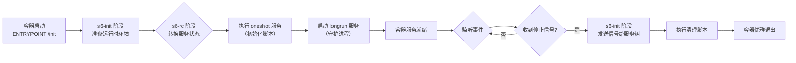

# Docker 容器内多进程服务管理

## 背景

当我们开始接触 Docker 容器时，有一个很重要的原则就是 “一个容器只运行一个进程”。

这是因为 Docker 容器与传统虚拟机不同，它并非一个独立的操作系统，而是通过 Linux 的 `Namespace` 和 `Cgroups` 技术实现的进程隔离环境。

简单来说，容器实际上是一个特殊的进程，它拥有独立的命名空间，无法感知到宿主机上的其他进程。

<br/>

话虽如此，但在实际场景中，某些情况下需要在单个容器内运行多个进程，比如：

- **紧密耦合的进程**
    - 遗留系统迁移：重构成本过高时，在容器内管理紧密耦合的进程更为务实
    - 共享关键资源：多个进程需共享 GPU 或共享内存段时，放在同一容器可简化资源管理
- **辅助进程与 Sidecar 模式**
    - 日志收集/监控代理：专门进程负责收集转发主进程的日志与指标
    - 本地缓存或代理：运行轻量级缓存服务（如 Redis）或代理，为主进程提供加速功能
- **开发与调试场景**
    - 开发阶段同时启动应用和依赖组件（如数据库），简化本地环境搭建

## 应用层多进程 vs 容器层多进程

在讨论容器内的多进程管理之前，需要先区分两个容易混淆的概念：**应用层多进程** 和 **容器层多进程**。

### 应用层多进程

应用层多进程是指应用程序自身的进程模型，典型代表是 Python Web 服务器如 `Gunicorn`、`uWSGI`。

```dockerfile
FROM python:3.13-slim

COPY app /app
COPY requirements.txt /app

RUN pip install --no-cache-dir -r /app/requirements.txt

WORKDIR /app

# 通过 Gunicorn 启动多个 worker 进程
CMD ["gunicorn", "-w", "4", "-b", "0.0.0.0:8000", "app:app"]
```

使用 `Gunicorn` 时：

- 容器只有一个主进程：`Gunicorn Master` 进程（PID 1）
- `Gunicorn` 内部管理多个 `Worker` 子进程，由 `Master` 进程负责管理
- 进程树结构：
  ```shell
  PID 1: gunicorn master
  ├── PID 10: gunicorn worker 1
  ├── PID 11: gunicorn worker 2
  ├── PID 12: gunicorn worker 3
  └── PID 13: gunicorn worker 4
  ```

使用 `Gunicorn` 的优点：

- 符合容器最佳实践：容器只有一个主进程（`Gunicorn Master`）
- 应用自身管理：`Gunicorn` 负责 `Worker` 的启动、监控、重启
- 信号处理完善：`Gunicorn Master` 正确处理 `SIGTERM`，优雅关闭所有 `Worker`
- 资源共享：`Worker` 进程可以共享内存、`Socket` 等资源

### 容器层多进程

容器层多进程是指在容器内运行 **多个独立** 的服务进程，这些进程通常是不同的应用程序。

```dockerfile
FROM ubuntu:24.04

# 安装 nginx 和 Python
RUN apt-get update && apt-get install -y nginx python3

# 同时运行两个独立的服务
# 1. Nginx（反向代理）
# 2. Python 应用（后端服务）

# 使用进程管理工具
COPY supervisord.conf /etc/supervisor/conf.d/

CMD ["/usr/bin/supervisord"]
```

使用 `Supervisord` 时：

- 存在多个独立的服务：Nginx 和 Python 应用是两个完全不同的程序
- 需要进程管理工具：需要 `Supervisor` / `s6-overlay` 来管理这些服务
- 进程树结构：
  ```shell
  PID 1: supervisord
  ├── PID 10: nginx master
  │   ├── PID 20: nginx worker 1
  │   └── PID 21: nginx worker 2
  └── PID 11: python app.py
  ```

### 关键对比

|       | 应用层多进程                  | 容器层多进程                 |
|-------|-------------------------|------------------------|
| 进程关系  | 父子进程，同一应用               | 独立进程，不同应用              |
| 管理者   | 应用程序自身（Gunicorn Master） | 外部进程管理器（supervisor/s6） |
| 容器主进程 | 应用程序（符合单进程原则）           | 进程管理器                  |
| 典型场景  | Web 服务器（并发处理请求）         | 运行多个独立服务（nginx + app）  |
| 配置复杂度 | 简单（应用参数）                | 较复杂（需配置文件）             |
| 信号处理  | 应用内置                    | 依赖管理工具                 |
| 资源共享  | 可以共享内存、Socket 等资源       | 仅限同一容器内进程间共享           |

## 多进程管理的挑战

在容器中运行多个进程会面临以下技术挑战：

### 僵尸进程问题

当容器的主进程（PID 1）不是一个合格的 init 进程时，子进程退出后可能变成僵尸进程。这是因为：

- 在 `Unix/Linux` 系统中，子进程退出后需要父进程调用 `wait()` 来回收资源
- 如果父进程没有正确处理 `SIGCHLD` 信号，子进程就会变成僵尸进程
- 僵尸进程会占用进程表项，长期累积可能导致系统无法创建新进程

### 信号处理问题

容器的 PID 1 进程需要正确处理和转发信号：

- Docker 发送的 `SIGTERM` 信号需要被正确接收和处理
- 需要将信号转发给所有子进程，确保优雅关闭
- 普通应用程序通常不具备这种信号处理能力

### 进程生命周期管理

- 如何启动多个进程并控制启动顺序
- 如何监控进程状态，在进程崩溃时自动重启
- 如何协调多个进程的关闭顺序

## 解决方案

### Shell 脚本

最简单但不推荐的方式是使用 shell 脚本：

```dockerfile
FROM ubuntu:24.04

COPY start.sh /start.sh
RUN chmod +x /start.sh

CMD ["/start.sh"]
```

```bash
#!/bin/bash
# start.sh

# 启动第一个服务
/usr/bin/service1 &

# 启动第二个服务
/usr/bin/service2 &

# 保持容器运行
wait
```

#### 总结

缺点：

- Shell 不是合格的 init 进程，无法正确处理僵尸进程
- 信号处理不完善，可能导致进程无法优雅关闭
- 缺乏进程监控和自动重启机制

### init / dumb-tini

`tini` 和 `dumb-init` 是专为容器设计的轻量级 init 系统，主要解决僵尸进程和信号转发问题。

#### tini

```dockerfile
FROM ubuntu:24.04

# 安装 tini
RUN apt-get update && apt-get install -y tini

# 使用 tini 作为入口点
ENTRYPOINT ["/usr/bin/tini", "--"]

# 启动脚本
CMD ["/start.sh"]
```

#### dumb-init

```dockerfile
FROM ubuntu:24.04

# 安装 dumb-init
RUN apt-get update && apt-get install -y dumb-init

# 使用 dumb-init 作为入口点
ENTRYPOINT ["/usr/bin/dumb-init", "--"]

CMD ["/start.sh"]
```

#### 总结

优点：

- ✅ 正确回收僵尸进程
- ✅ 转发信号给所有子进程
- ✅ 极其轻量（几百 KB）

缺点：

- ❌ 不提供进程监控和自动重启
- ❌ 不支持复杂的启动顺序控制

#### 适用场景

只需要基本的 `init` 功能，进程管理由其他方式（如 `Kubernetes / docker-compose`）负责。

### Supervisor

Supervisor 是一个成熟的进程管理工具，提供完整的进程监控和管理功能。

#### 安装和配置

```dockerfile
FROM ubuntu:24.04

# 安装 supervisor
RUN apt-get update && apt-get install -y supervisor

# 复制配置文件
COPY supervisord.conf /etc/supervisor/conf.d/supervisord.conf

# 通过 supervisord 进程托管其他子进程
CMD ["/usr/bin/supervisord", "-c", "/etc/supervisor/conf.d/supervisord.conf"]
```

#### 配置示例

```text
[supervisord]
nodaemon=true
user=root
logfile=/var/log/supervisor/supervisord.log
pidfile=/var/run/supervisord.pid

[program:nginx]
command=/usr/sbin/nginx -g "daemon off;"
autostart=true
autorestart=true
...

[program:app]
command=/usr/local/bin/python /app/main.py
autostart=true
autorestart=true
...
```

#### 总结

优点：

- ✅ 完善的进程监控和自动重启
- ✅ 灵活的配置选项
- ✅ 提供 Web 管理界面（可选）
- ✅ 支持进程优先级和依赖关系

缺点：

- ❌ 相对较重（Python 依赖）
- ❌ 信号处理不够完善

适用场景：需要完整的进程管理功能，对容器大小不敏感。

### s6-overlay

s6-overlay 是基于 s6 进程监控套件的容器化解决方案，专为容器环境设计。

#### 安装

```dockerfile
FROM ubuntu:24.04

# 下载并安装 s6-overlay
ARG S6_OVERLAY_VERSION=v3.2.1.0
ADD https://github.com/just-containers/s6-overlay/releases/download/${S6_OVERLAY_VERSION}/s6-overlay-noarch.tar.xz /tmp
ADD https://github.com/just-containers/s6-overlay/releases/download/${S6_OVERLAY_VERSION}/s6-overlay-x86_64.tar.xz /tmp

RUN tar -C / -Jxpf /tmp/s6-overlay-noarch.tar.xz \
    && tar -C / -Jxpf /tmp/s6-overlay-x86_64.tar.xz \
    && rm -rf /tmp/*.tar.xz

ENTRYPOINT ["/init"]
```

#### 配置

服务目录结构：

```bash
/etc/s6-overlay/s6-rc.d/
├── nginx/
│   ├── type          # 内容: longrun
│   ├── run           # 启动脚本
│   └── finish        # 清理脚本（可选）
├── app/
│   ├── type
│   ├── run
│   └── dependencies.d/
│       └── nginx     # 依赖 nginx 先启动
└── user/
    └── contents.d/
        ├── nginx
        └── app
```

nginx 服务示例：

```bash
#!/command/execlineb -P
# /etc/s6-overlay/s6-rc.d/nginx/run

nginx -g "daemon off;"
```

app 服务示例：

```bash
#!/command/execlineb -P
# /etc/s6-overlay/s6-rc.d/app/run

cd /app
exec python main.py
```

#### 执行机制



##### `s6-init` 阶段：主入口

这个阶段由 `/init` 脚本主导，它作为容器的主进程，承担着以下职责：

- 主进程管理：它作为所有进程的父进程（`PID 1`），负责回收僵尸进程，确保系统资源不被占用。
- 信号代理：`/init` 会将 `SIGTERM` 信号传递给所有被它监督的子进程，从而实现整个容器内进程树的优雅关闭。
- 环境准备：`/init` 可根据 `/etc/fix-attrs.d/` 和 `/etc/fix-attrs.d/` 中的配置执行环境准备工作，为后续服务的启动提供基础。
- 数据清理：`/init` 也可根据 `/etc/cont-finish.d/` 中的配置，在容器进程退出后，进行数据清理工作。

##### `s6-rc` 阶段：服务依赖管理与状态转换

服务启动和依赖管理的核心引擎是 `s6-rc`。它通过读取 `/etc/s6-overlay/s6-rc.d/` 目录下的配置文件来工作。

每个服务（例如 Web 服务器或数据库）在此目录下都有一个属于自己的子目录，其中包含几个关键文件：

- `type`：明确服务的类型，最常见的是 `longrun`（长期运行的服务，如 `Nginx`）和 `oneshot`（只执行一次的脚本，如 `Migration`）。
- `dependencies`：可选的纯文本文件，其中可以列出此服务所依赖的其他服务名称。`s6-rc` 会严格根据这些依赖关系来决定服务的启动顺序。
- `run`：可执行的脚本文件，包含了启动该服务的具体命令。

`s6-rc` 能够根据这些配置，自动解析依赖关系，并形成一个正确的服务启动序列，彻底解决了手动管理启动顺序的繁琐和不可靠问题。

#### 总结

优点：

- ✅ 专为容器设计，轻量高效
- ✅ 完善的进程监控和自动重启
- ✅ 优雅的信号处理和关闭流程
- ✅ 支持服务依赖关系
- ✅ 支持初始化脚本和环境变量处理

缺点：

- ❌ 学习曲线较陡峭
- ❌ 配置相对复杂

适用场景：生产环境中需要可靠的多进程管理，追求轻量和高效。

## 方案对比

| 特性     | Shell 脚本 | tini / dumb-init | Supervisor | s6-overlay |
|--------|----------|------------------|------------|------------|
| 僵尸进程回收 | ❌        | ✅                | ✅          | ✅          |
| 信号转发   | ❌        | ✅                | ⚠️         | ✅          |
| 进程监控   | ❌        | ❌                | ✅          | ✅          |
| 自动重启   | ❌        | ❌                | ✅          | ✅          |
| 依赖管理   | ❌        | ❌                | ⚠️         | ✅          |
| 镜像大小   | 最小       | 很小               | 中等         | 小          |
| 配置复杂度  | 简单       | 简单               | 中等         | 较复杂        |

## 实践建议

### 优先考虑容器编排

在大多数情况下，应该优先使用 Kubernetes、Docker Compose 等容器编排工具来管理多个服务，而不是在单个容器内运行多个进程。

```yaml
# docker-compose.yml
version: "3"
services:
  nginx:
    image: nginx:latest
    ports:
      - "80:80"

  app:
    image: myapp:latest
    depends_on:
      - nginx
```

### 合适的工具

- **简单场景**：只需要基本的 init 功能 → 使用 `tini` 或 `dumb-init`
- **开发环境**：需要快速启动多个服务 → 使用 `Supervisor`
- **生产环境**：需要可靠的进程管理 → 使用 `s6-overlay`
- **遗留系统**：无法拆分的紧密耦合服务 → 使用 `s6-overlay` 或 `Supervisor`

### 最佳实践

- **日志管理**：确保所有进程的日志输出到 `stdout / stderr`，便于容器日志收集
- **健康检查**：配置 Docker 健康检查，监控容器内所有关键进程
- **优雅关闭**：确保所有进程能够正确响应 `SIGTERM` 信号
- **资源限制**：为容器设置合理的 CPU 和内存限制
- **监控告警**：使用 Prometheus 等工具监控容器内进程状态

## 总结

虽然 Docker 提倡"一个容器一个进程"的原则，但在某些特定场景下，在容器内运行多个进程是合理且必要的。关键是选择合适的工具来管理这些进程：

- 对于简单场景，`tini` 或 `dumb-init` 足以解决基本问题
- 对于需要完整进程管理的场景，`s6-overlay` 是最佳选择
- 对于快速开发和原型验证，`Supervisor` 提供了良好的平衡

无论选择哪种方案，都要确保正确处理僵尸进程、信号转发和优雅关闭，这样才能构建稳定可靠的容器化应用。

## 参考资料

- [krallin/tini: A tiny but valid init for containers](https://github.com/krallin/tini)
- [Yelp/dumb-init: A minimal init system for Linux containers](https://github.com/Yelp/dumb-init)
- [Supervisor: Supervisor process control system for Unix (supervisord)](https://github.com/Supervisor/supervisor)
- [just-containers/s6-overlay: s6 overlay for containers (includes execline, s6-linux-utils & a custom init)](https://github.com/just-containers/s6-overlay)
- [s6-overlay practice in blueking-paas dev-sandbox](https://github.com/TencentBlueKing/blueking-paas/blob/builder-stack/cnb-builder-shim/docker-build/heroku-builder/dev.Dockerfile)